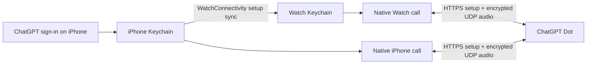

# Dot

**Your agent, a call away.** An experimental iPhone and Apple Watch client for voice calls with an existing ChatGPT Dot.

<p>
  
  
  
</p>

Screenshots are actual simulator captures with generic branding. The call screenshot uses a local synthetic audio peer; it contains no account or conversation data.

- Start a call from your Watch, iPhone, Smart Stack, or watch-face complication.
- Speak and listen on the device making the call, with native call controls and mute.
- Sign in on iPhone, then sync the session to the paired Watch. Calls connect directly from the Watch, including while the iPhone is locked after initial setup.
- Includes “Call Dot” and “Talk to Dot” App Shortcuts. Spoken Siri recognition and locked-device Siri invocation still need hardware verification.
- Customize the app name, icon, accent, Siri aliases and signing with a local configuration. Personal builds use the same source.

This is an independent personal project, unaffiliated with OpenAI or Apple. It uses an **undocumented ChatGPT browser interface**, not a supported public API. You need your own account with Dot access; availability and compatibility can change. It is not an App Store release.

## Build and connect

Requirements: macOS with Xcode 27 / Swift 6.4, XcodeGen, Python 3, iOS 26+ and watchOS 26+. The current dependencies require Swift 6.4. Builds were checked using the iOS/watchOS 27 SDKs.

```sh
cp Config.example.json Config.local.json
# Edit bundle_id and development_team for your own Apple signing identity.
python3 Tools/configure.py
xcodegen generate
open DotWatch.xcodeproj
```

1. Choose the **DotWatchPhone** scheme and your paired iPhone. Build and run. The Watch app and widget are bundled with it.
2. Open **Dot** on iPhone → **Connect ChatGPT**. Sign in on the official ChatGPT page within the app.
3. Paste the URL of your Dot page (`https://chatgpt.com/dots/<page-id>`) into the field, then tap **Connect**. A page UUID is also accepted. The page must belong to the signed-in account.
4. Open Dot on both devices once to finish session sync. Allow microphone access when prompted, then tap **Call** on the device you want to use.
5. Add **Dot → Call Dot** to the Watch Smart Stack or select the circular complication on a compatible face.

Keep your bundle ID, URL scheme and widget kind stable across personal updates. Changing them creates a different app or breaks existing widget links. See [configuration](docs/CONFIGURATION.md) and [troubleshooting](docs/TESTING.md).

## How it works



The Watch runs signaling, session renewal, Opus audio and WebRTC transport itself. The operating system can provide internet access through the paired iPhone; the iPhone application does not relay the call. No Mac or self-hosted server is needed at runtime.

## Privacy and limits

Session tokens and eligible ChatGPT cookies are saved in device-only Keychain storage on the paired devices. The login web view also retains its normal website data. These sessions grant access to your account: use your own trusted devices and never publish app containers, logs, cookies or signed builds. See [security](SECURITY.md).

Initial connection can take tens of seconds while the service creates and attaches the call. The transport currently uses UDP without TURN/TCP fallback or seamless network handover. A compatible network and usable saved session are required; expired or revoked sessions need sign-in on iPhone again. After reboot, each device needs its first unlock before saved Keychain items become available.

The earlier personal build was reported working on a physical Watch with a locked iPhone, including Smart Stack after re-adding its widget. The configurable release build has simulator and build validation; it has not yet been installed and rechecked on physical devices. Simulator tests substitute CallKit and generate audio without using a microphone or speaker.

## Development

```sh
python3 Tools/test_configuration.py
swift test --package-path DirectRTC
# Generate the project first, then select your booted iPhone simulator:
xcodebuild -project DotWatch.xcodeproj -scheme DotWatchTests \
  -destination 'platform=iOS Simulator,id=YOUR_PHONE_SIMULATOR_ID' \
  CODE_SIGNING_ALLOWED=NO test
```

[Silent call tests and evidence](docs/TESTING.md) · [Build configuration](docs/CONFIGURATION.md) · [Third-party notices](THIRD_PARTY_NOTICES.md)

First-party code and default artwork are MIT licensed. Vendored code and fetched dependencies retain their own terms. **The pinned `swift-networking` revision has no license declaration found in its repository; redistribution licensing remains unresolved.** See the dependency notes before distributing binaries.
