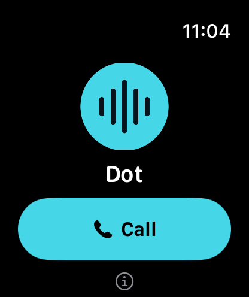
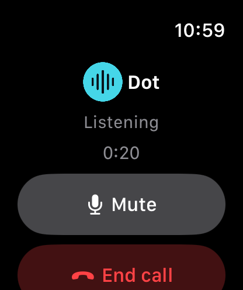
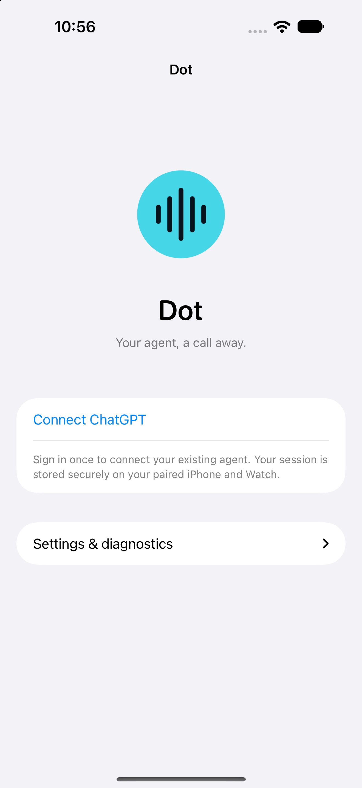
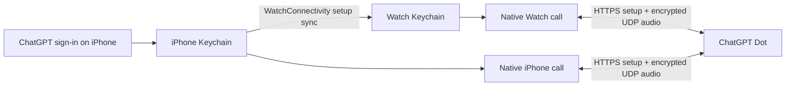

# Dot

**Your agent, a call away.** An experimental iPhone and Apple Watch client for voice calls and recorded voice messages with an existing ChatGPT Dot.

<p>
  
  
  
</p>

Screenshots are actual simulator captures with generic branding. The call screenshot uses a local synthetic audio peer; it contains no account or conversation data.

- Start a call from your Watch, iPhone, Smart Stack, or watch-face complication. The rectangular Smart Stack widget has separate **Call** and **Speak** buttons.
- Tap **Speak** beside **Call** on iPhone or Watch to record a voice message. **Send** saves it locally and immediately returns to the main screen while transcription and delivery continue.
- Check **Messages** for queued, sending, sent or failed delivery; retry a saved message when needed.
- Speak and listen on the device making the call, with native call controls and mute. On iPhone, **Audio output** opens Apple’s route picker during an active call; available destinations depend on iOS and the connected devices. HomePod two-way call routing has not been verified.
- Sign in on iPhone, then sync the session to the paired Watch. Calls connect directly from the Watch, including while the iPhone is locked after initial setup.
- Provides **Call agent** and **Record voice message** actions in Apple Shortcuts for your own shortcuts and automations. Recording opens the app on the device running the action; you tap **Send** when finished.
- Customize the app name, icon, accent, Siri aliases and signing with a local configuration. Personal builds use the same source.

This is an independent personal project, unaffiliated with OpenAI or Apple. It uses an **undocumented ChatGPT browser interface**, not a supported public API. You need your own account with Dot access; availability and compatibility can change. It is not an App Store release.

## Build and connect

Requirements: an Apple silicon Mac with Xcode 27 / Swift 6.4, XcodeGen, Python 3, iOS 26+ and watchOS 26+. The current dependencies require Swift 6.4. Builds were checked using the iOS/watchOS 27 SDKs. The first native audio build downloads pinned open-source dependencies and build tools; subsequent builds reuse its local cache.

```sh
cp Config.example.json Config.local.json
# Edit bundle_id and development_team for your own Apple signing identity.
python3 Tools/configure.py
bash Tools/build-neteq.sh
xcodegen generate
open DotWatch.xcodeproj
```

1. Choose the **DotWatchPhone** scheme and your paired iPhone. Build and run. The Watch app and widget are bundled with it.
2. Open **Dot** on iPhone → **Connect ChatGPT**. Sign in on the official ChatGPT page within the app.
3. Paste the URL of your Dot page (`https://chatgpt.com/dots/<page-id>`) into the field, then tap **Connect**. A page UUID is also accepted. The page must belong to the signed-in account.
4. Open Dot on both devices once to finish session sync. Allow microphone access when prompted, then tap **Call** on the device you want to use.
5. Add **Dot → Call or Speak** to the Watch Smart Stack, or select the circular Call complication on a compatible face.

Keep your bundle ID, URL scheme and widget kind stable across personal updates. Changing them creates a different app or breaks existing widget links. See [configuration](docs/CONFIGURATION.md) and [troubleshooting](docs/TESTING.md).

## Shortcuts and automations

In Apple Shortcuts, create a shortcut, choose **Add Action**, and find the configured app name under **Apps**. Add **Call agent** to open the app and start a call, or **Record voice message** to open the recorder. Both actions require the foreground app and may prompt you to unlock the executing device. You can use these actions in your own shortcuts and attach the shortcuts to available automation triggers; no spoken command is required.

Recording requires the app to become visible and may require unlocking the device. The action does not accept an audio file, record silently in the background, or send without your **Send** tap. Each device keeps its own recordings and outbox. Custom automation triggers and locked-device execution need physical-device verification.

## Voice messages

After connecting, tap **Speak** to start recording. Tap **Stop** to finish recording, or **Send** while recording to stop and queue the message. A recording must be at least one second long. There is no fixed time limit: recording stops near the app's 10 MB recording size limit, checked against the actual audio file size, with space left for the encoder to finish writing. The final file must fit that file-size guard. **Cancel** deletes the draft. Leaving the recording screen, backgrounding the app, or an audio interruption such as Siri stops capture; a usable draft stays available as **Resume** while the app remains running. Recording and calls cannot hold the microphone at the same time.

Each device keeps a persistent outbox with up to five unsent messages. **Send** returns after saving the recording, without waiting for the service. A status below the buttons opens **Messages**, where failures offer **Retry** and completed or failed messages can be removed. **Sent** requires a message receipt from Dot; it does not mean Dot has replied. The home-screen **Message sent** notice clears when you reopen the app or finish a call; delivery history remains in **Messages**. A short transcript preview appears below the status without interrupting the app; open **Messages** to read its full text. The preview clears on reopening, after a call, or when you send a new recording. Delivered text is kept only in memory for this preview. If delivery is uncertain, check the Dot conversation before retrying. Retries reuse the message ID, but this undocumented service offers no supported deduplication guarantee.

Transcription and message delivery use HTTPS from the recording device. iOS and watchOS schedule background uploads and may defer processing while the app is closed, offline or conserving power. There is no guaranteed completion time; reopening the app resumes work. Expired sign-in needs iPhone reconnection and Watch sync. Saved messages stay bound to their original account and Dot and cannot be redirected by connecting another account.

## How it works



The Watch runs signaling, session renewal, Opus audio and WebRTC transport itself. The operating system can provide internet access through the paired iPhone; the iPhone application does not relay the call. No Mac or self-hosted server is needed at runtime.

Incoming call audio uses WebRTC NetEq and libopus for adaptive buffering, time scaling and loss concealment. Playback runs at mono 48 kHz; outgoing microphone encoding remains at 24 kHz. See [incoming audio](docs/NETEQ.md) for the selected settings and latency tradeoff.

## Privacy and limits

Session tokens and eligible ChatGPT cookies are saved in device-only Keychain storage on the paired devices. The login web view also retains its normal website data. These sessions grant access to your account: use your own trusted devices and never publish app containers, logs, cookies or signed builds. Voice recordings and unsent transcripts are stored in protected, backup-excluded local device storage until delivery or removal. See [security](SECURITY.md).

Initial connection can take tens of seconds while the service creates and attaches the call. The transport currently uses UDP without TURN/TCP fallback or seamless network handover. A compatible network and usable saved session are required; expired or revoked sessions need sign-in on iPhone again. After reboot, each device needs its first unlock before saved Keychain items become available.

Build 32 passed 43 DirectRTC tests on both macOS and iPhone Simulator, 76 app tests, signed iPhone/Watch builds, and silent local simulator calls on both devices. The NetEq integration reproduced all three private comparison recordings sample-for-sample over their recorded intervals. Simulator calls substitute CallKit and generate audio without using a microphone or speaker; they do not establish hardware sound quality, battery use, Bluetooth routing or locked-device behavior. See [validation history and hardware checks](docs/TESTING.md).

## Development

```sh
python3 Tools/test_configuration.py
bash Tools/build-neteq.sh
swift test --package-path DirectRTC
# Generate the project first, then select your booted iPhone simulator:
xcodebuild -project DotWatch.xcodeproj -scheme DotWatchTests \
  -destination 'platform=iOS Simulator,id=YOUR_PHONE_SIMULATOR_ID' \
  CODE_SIGNING_ALLOWED=NO test
```

[Silent call tests and evidence](docs/TESTING.md) · [Build configuration](docs/CONFIGURATION.md) · [Third-party notices](THIRD_PARTY_NOTICES.md)

First-party code and default artwork are MIT licensed. Vendored code and fetched dependencies retain their own terms. **The pinned `swift-networking` revision has no license declaration found in its repository; redistribution licensing remains unresolved.** See the dependency notes before distributing binaries.

### Optional call audio diagnostics

For reproducible audio troubleshooting, open **Call audio diagnostics** in iPhone settings or Watch Info and enable **Record next call**. Recording is off by default and applies to one explicitly selected call. With it off, no audio capture files are written; enabled capture adds bounded serialization and disk work. Recordings stay local until you explicitly export or transfer them. See [capture, replay and overhead](docs/AUDIO_DIAGNOSTICS.md). This diagnostic option does not change the call audio algorithm.
